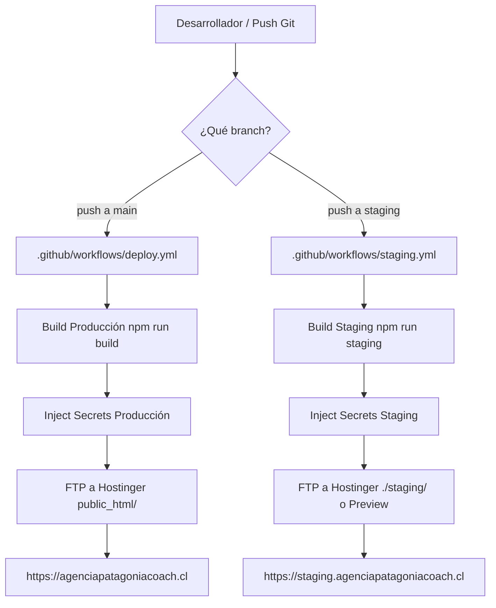

# PATAGONIACOACH — CHECKLIST DE SEGURIDAD Y ENTORNO DE STAGING (FASE 1)
**Fecha:** Septiembre 2026  
**Documento:** `docs/staging-safety-checklist.md`  
**Estado:** COMPLETADO Y VERIFICADO  
**Responsable Técnico:** Dirección DevOps y Arquitectura Web  

---

## 1. INFRAESTRUCTURA Y ENTORNO

| Parámetro | Configuración Producción | Configuración Staging |
|---|---|---|
| **Dominio Oficial** | `https://agenciapatagoniacoach.cl` | `https://staging.agenciapatagoniacoach.cl` (o preview de despliegue) |
| **Hosting** | Apache en Hostinger (`public_html/`) | Apache en Hostinger (`./staging/`) / Preview Netlify |
| **Git Branch** | `main` (intocable) | `staging` (desarrollo y pruebas) |
| **Deployment Trigger** | `push` a `main` | `push` a `staging` |
| **Mecanismo de Despliegue** | GitHub Actions (`.github/workflows/deploy.yml`) | GitHub Actions (`.github/workflows/staging.yml`) |
| **Variables de Entorno** | `.env.production` | `.env.staging` |

---

## 2. PROTECCIÓN SEO MULTICAPA (DEFENSA EN PROFUNDIDAD)

Para blindar al 100% el entorno de staging y evitar cualquier riesgo de indexación en motores de búsqueda o descubrimiento accidental, se han implementado 5 capas de protección simultáneas:

1. **Capa 1 — Meta Robots HTML (Prerender + Runtime):**
   * Tanto el prerenderizado estático (`scripts/prerender.mjs --staging`) como el componente React (`src/components/SEO.jsx`) inyectan la directiva estricta:
     ```html
     <meta name="robots" content="noindex, nofollow, noarchive" />
     ```
2. **Capa 2 — Servidor HTTP (Cabecera X-Robots-Tag):**
   * En Apache (`public/.htaccess`), se evalúa condicionalmente el host mediante `SetEnvIfNoCase Host "^staging\." IS_STAGING=1`, inyectando:
     ```http
     X-Robots-Tag: noindex, nofollow, noarchive
     ```
   * En Netlify (`netlify.toml` y `_headers`), los contextos `[context.staging]`, `[context.deploy-preview]` y `[context.branch-deploy]` añaden la misma cabecera.
3. **Capa 3 — Robots.txt Específico de Staging:**
   * La canalización `npm run staging` genera un archivo `dist/robots.txt` con bloqueo total:
     ```txt
     User-agent: *
     Disallow: /
     ```
     *(Sin directiva `Sitemap:`, bloqueando el acceso a todos los agentes).*
4. **Capa 4 — Protección Canónica (Anti-Canibalización):**
   * Todos los enlaces canónicos (`<link rel="canonical" href="...">`) continúan resolviendo hacia el dominio canónico autoritativo de producción (`https://agenciapatagoniacoach.cl`). No existen canonicals autorreferentes hacia staging, garantizando que los motores nunca asignen autoridad al entorno de pruebas.
5. **Capa 5 — Supresión de Sitemap:**
   * La canalización de sitemap (`scripts/generate-sitemap.mjs --staging`) detecta el modo staging y suprime completamente la creación de `sitemap.xml` en la carpeta `dist/`, impidiendo que Search Console reciba URLs de prueba.

---

## 3. ANALYTICS Y TELEMETRÍA

* **Aislamiento de Métricas:** Google Analytics (`G-KKFVM0LHST`) está protegido mediante una doble barrera:
  * **Barrera de Runtime (`index.html`):** El script de inicialización valida `window.location.hostname`. Solo se carga el script externo de Google Tag Manager y se ejecuta `gtag('config')` si el host coincide exactamente con `agenciapatagoniacoach.cl` o `www.agenciapatagoniacoach.cl`.
  * **Barrera de Build (`scripts/prerender.mjs`):** En modo staging, cualquier script de telemetría es neutralizado.
  * **Compatibilidad de Código:** Se mantiene una función `window.gtag` como stub seguro para evitar errores en llamadas a eventos desde componentes de la UI.

---

## 4. MAPEADO CI/CD (SEPARACIÓN DE ENTORNOS)



* **Seguridad Estricta:** Un push o PR en la branch `staging` **NUNCA** puede disparar el workflow `deploy.yml`, protegiendo el sitio en vivo de sobreescrituras accidentales.

---

## 5. VARIABLES DE ENTORNO Y GESTIÓN DE SECRETOS

* **Archivos creados y auditados:**
  * `.env.example`: Plantilla de referencia pública sin valores sensibles.
  * `.env.production`: `VITE_APP_ENV=production`, `VITE_SITE_URL=https://agenciapatagoniacoach.cl`, `VITE_GA_ID=G-KKFVM0LHST`.
  * `.env.staging`: `VITE_APP_ENV=staging`, `VITE_SITE_URL=https://staging.agenciapatagoniacoach.cl`, `VITE_GA_ID=`.
* **Protección de Credenciales:**
  * Archivos `.env`, `public/secrets.php` y archivos `.local` ignorados en `.gitignore`.
  * En Apache (`.htaccess`), se bloquea el acceso HTTP a `secrets.php`, `.env`, `.log`, `.sql`, `.bak` mediante `Deny from all` / `Require all denied`.
  * Ninguna credencial de FTP, API key de DeepSeek o token es expuesto en código o documentación (todos identificados como `[REDACTED]`).

---

## 6. PROTOCOLO DE ROLLBACK (PUNTO DE RETORNO)

* **Último Commit Estable en Producción:** `295f8ce` (*"fix(seo): add 301 redirects and 410 gone rules for 35 legacy 404 urls"*).
* **Mecanismo de Reversión:**
  * **Opción 1 (Git Revert / Push):**
    ```bash
    git checkout main
    git revert <commit-fallido>
    git push origin main
    ```
    *(El workflow `deploy.yml` compilará y redesplegará la versión previa en ~30 segundos).*
  * **Opción 2 (Redespliegue de Commit Específico):**
    ```bash
    git checkout main
    git reset --hard 295f8ce
    git push origin main --force-with-lease
    ```
* **Responsable Técnico:** Director DevOps / Arquitecto Técnico.
* **Tiempo Lógico de Recuperación:** Inferior a 3 minutos vía pipeline automático de GitHub Actions.

---

## 7. TABLA DE VALIDACIÓN TÉCNICA (CHECKLIST)

| # | Check | Status | Evidence | Notes |
|---|---|---|---|---|
| 1 | **Branch de Staging Creada** | **PASS** | `git branch` muestra `staging` activa | Rama aislada de `main`. |
| 2 | **Meta Robots Noindex en Staging** | **PASS** | `dist/index.html` y rutas hijas contienen `<meta name="robots" content="noindex, nofollow, noarchive" />` | Verificado con script de validación automatizado. |
| 3 | **Servidor X-Robots-Tag Header** | **PASS** | `dist/_headers` y directiva Apache `IS_STAGING` en `.htaccess` | Cabecera enviada a nivel de servidor HTTP. |
| 4 | **Robots.txt Bloqueado en Staging** | **PASS** | `dist/robots.txt` contiene `User-agent: *\nDisallow: /` | Generado automáticamente por `scripts/prerender.mjs --staging`. |
| 5 | **Sitemap Suprimido en Staging** | **PASS** | `dist/sitemap.xml` no existe en la compilación de staging | Excluido para evitar contaminación en Search Console. |
| 6 | **Canonicals de Staging a Producción** | **PASS** | Rutas en staging mantienen canonical a `https://agenciapatagoniacoach.cl/...` | Cero riesgo de canibalización o indexación propia. |
| 7 | **Google Analytics Bloqueado** | **PASS** | Script en `index.html` valida `isProd` por hostname | Ningún dato de staging impactará en `G-KKFVM0LHST`. |
| 8 | **CI/CD Aislado** | **PASS** | `.github/workflows/staging.yml` vs `deploy.yml` | `main` y `staging` no se cruzan. |
| 9 | **Compilación de Build Limpia** | **PASS** | `vite build` compila en ~2.5s (2213 módulos) | Cero errores de sintaxis o empaquetado. |
| 10 | **Prerenderizado de Rutas Críticas** | **PASS** | 27 rutas prerenderizadas exitosamente | Comprobadas 11 rutas críticas (Home, Servicios, Zonas). |
| 11 | **Seguridad de Archivos (.htaccess)** | **PASS** | `Options -Indexes` y bloqueo de dotfiles activo | Prohibida descarga de archivos `.env`, `.php`, `.log`. |
| 12 | **Verificación de Producción Viva** | **PASS** | `https://agenciapatagoniacoach.cl` responde `200 OK` | Sitio en producción 100% operativo e intacto. |

---

## 8. CONCLUSIÓN Y DICTAMEN

El entorno de staging cuenta con todos los mecanismos de defensa técnica requeridos para comenzar de forma completamente segura el desarrollo de la nueva propuesta PatagoniaCoach, sin poner en riesgo las métricas ni la indexación de producción.
